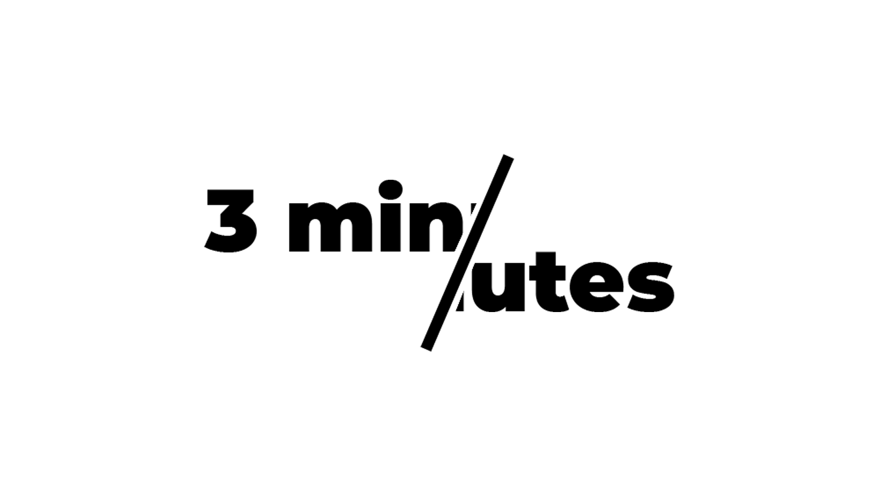

# Titre

3 minutes

## Les créateurs et créatrices

* Naoufal Bensaiad
* Jérémie Lévesque
* Samuel Poulin

## La façon dont le thème du temps est exploité dans la création

Après avoir vecu 3 minutes de bonheur on revit 3 minutes enfermé dans un casier sombre et l'on remarque que le temps passe beaucoup plus lentement.

## L'ambiance

Ce projet montre a quel point les gens persécuter peuvent se sentir mal et avoir l'impression que leur vie n'est qu'une éternelle souffrance.

## L'installation en cours dans les studios 

## Le schéma de l'installation prévue 

[Source schéma de plantation](https://tim-montmorency.com/2022/projets/Chere-Sasha/docs/web/index.html)

## Ce qui sera attendu de nous, en tant qu'interacteur.trice, lorsque l'ont vivra l'expérience de l'installation

Passez trois minutes en VR a jouer au ballon chasseur, ensuite trois autre minutes enfermé seul dans un casier sombre.

## 3 cours du programme qui serait nécessaire pour la réalisation de ce projet

* Modélisation 3D
* Réalité virtuel
* Conception sonore

## Technique inconnue

Réalité Virtuel

## Composante inconnue

Détecteur de mouvement

