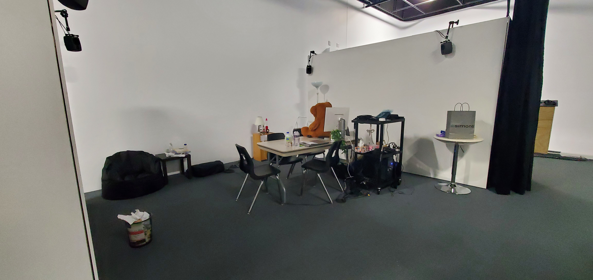

# Titre

Chère Sasha

## Les créateurs et créatrices

* Trish Nguyen
* Angelina De Silva Jeca
* Karine Cormier
* Sabrina Kayani

## La façon dont le thème du temps est exploité dans la création

On se retrouve dans la chambre de Sasha adolescente et a l'âge adulte.

## L'ambiance

Après cette expérience on remarque que la vie adulte peut être libératrice et l'on se soucis de moin en moin de l'opinion négatif des autres.

## L'installation en cours dans les studios 

[Source décors](https://tim-montmorency.com/2022/projets/Chere-Sasha/docs/web/index.html)

## Le schéma de l'installation prévue 

[Source schéma de plantation](https://tim-montmorency.com/2022/projets/Chere-Sasha/docs/web/index.html)

## Ce qui sera attendu de nous, en tant qu'interacteur.trice, lorsque l'ont vivra l'expérience de l'installation

Cette installation est contemplative, donc ce qui est attendu de nous est simplement d'apprécier le moment et suivre Sasha dans son aventure. 

## 3 cours du programme qui serait nécessaire pour la réalisation de ce projet

Conception vidéo
Animation 2D
Conception sonore

## Technique inconnue

QLC

## Composante inconnue

Arduino nano (un type de carte microcontrôleur)

