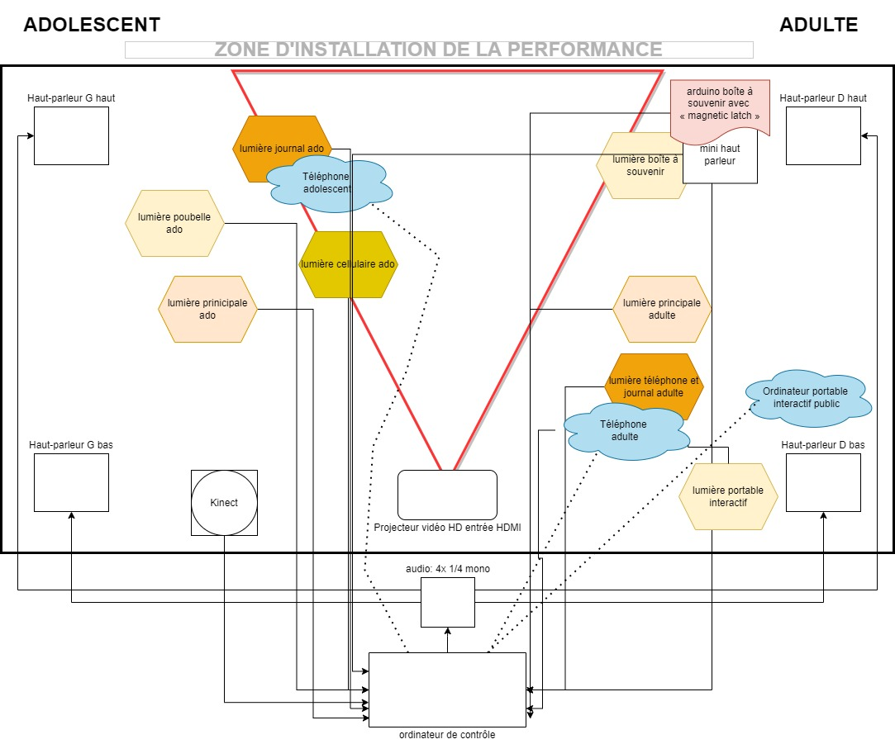

# Titre

Chère Sasha

## Les créateurs et créatrices

* Naoufal Bensaiad
* Jérémie Lévesque
* Samuel Poulin

## La façon dont le thème du temps est exploité dans la création

On se retrouve dans la chambre de Sasha adolescente et a l'âge adulte.

## L'ambiance

Après cette expérience on remarque que la vie adulte peut être libératrice et l'on se soucis de moin en moin de l'opinion négatif des autres.

## L'installation en cours dans les studios 

## Le schéma de l'installation prévue 

[Source schéma de plantation](https://tim-montmorency.com/2022/projets/Chere-Sasha/docs/web/index.html)

## Ce qui sera attendu de vous, en tant qu'interacteur.trice, lorsque vous ferez l'expérience de l'installation

## 3 cours du programme qui vous semblent incontournables pour avoir les compétences pour créer ce projet

