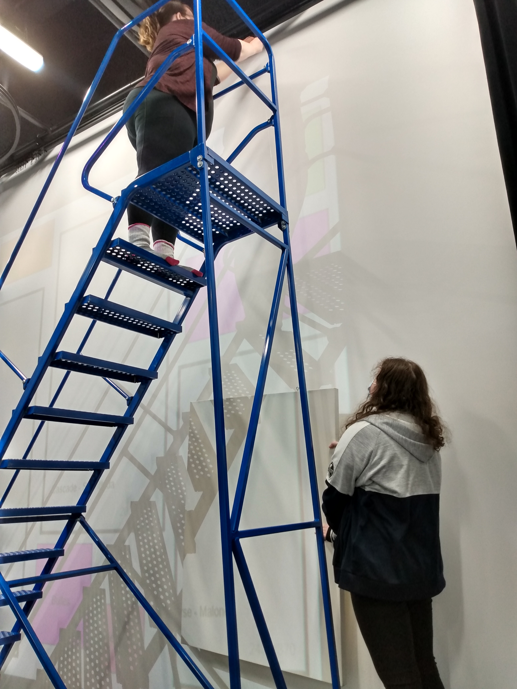
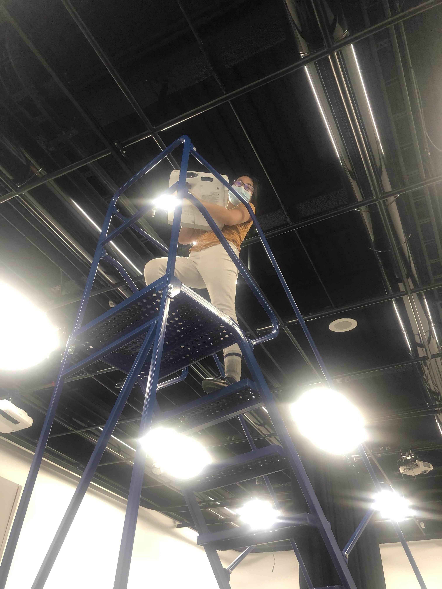
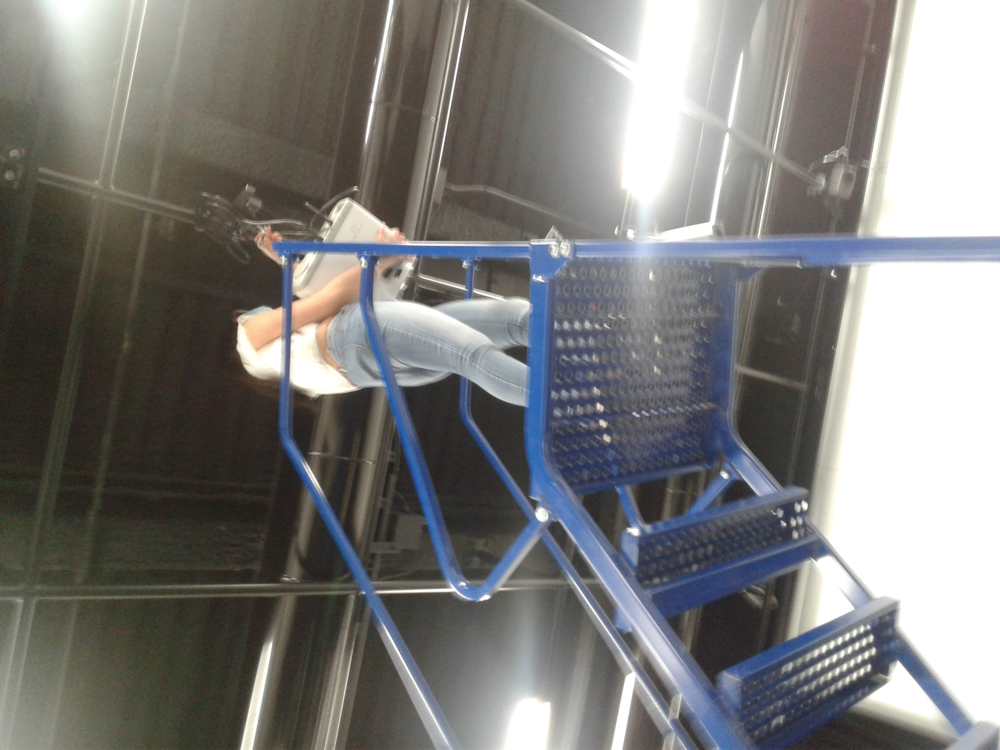
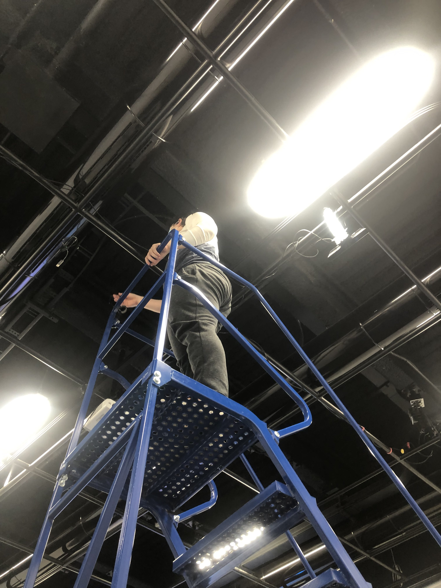
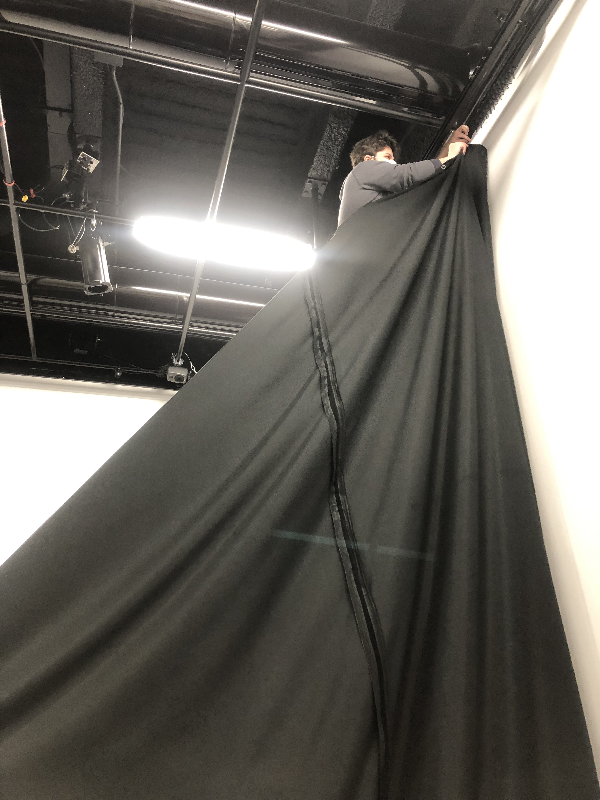
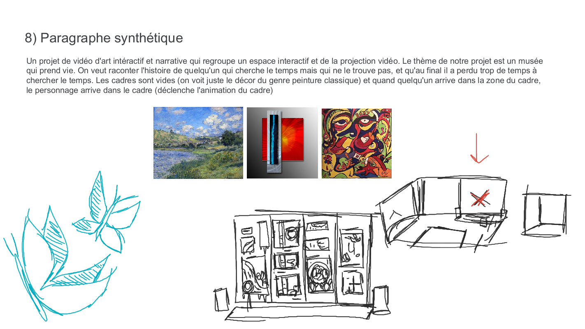

# Ceci est le dossier de présentation du projet Chrononaufrage

# Titre
Chronaufrage

## Créateurs
Maloney Khim, Sounthida Kong, Olivier Lalonde, Rebecca Pilotte, et Émilie Fontaine

## Facon dont le thème a été utilisé
La vitesse du vidéo est influencé par la position de l'interacteur.
## Ambiance
L'ambiance est triste et détendu

## Installation du matériel dans le studio

## Schéma de l'installation

Source:https://tim-montmorency.com/2022/projets/Chronaufrage/docs/web/preproduction.html

## Expérience de l'installation
Pour faire fonctionner l'installation, nous devons faire des mouvements devant la kinect pour que les écrans s'animent.

## Programmes essentiels
Les programmes essentiels pour faire ce projet sont atelier d'illustration numérique, animation 2D et conception vidéo.

## Technique inconnue
L'effet de diaporama/depth mapping avec la détection de présence.

## Composante inconnue
Le kit POE
