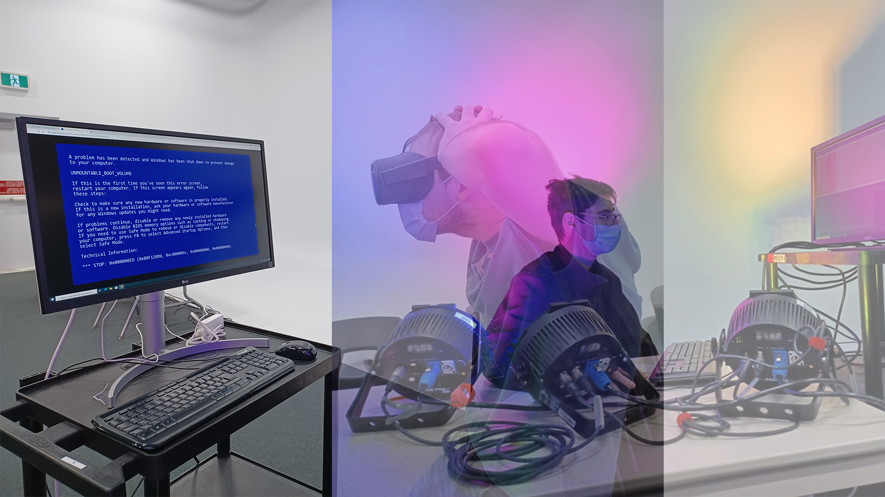
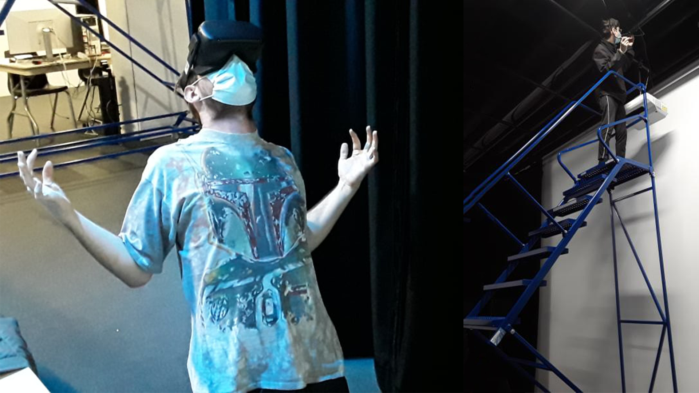

# Ceci est le dossier de présentation du projet Distortion collective

# Distortion collective

## Réalisé par William Dubois et Ghislain Lacombe

## Facon dont le thème a été utilisé
La vitesse du vidéo est influencé par la position de l'interacteur.
## Ambiance
L'ambiance est angoissante

## Installation du matériel dans le studio

## Schéma de l'installation

Source:https://tim-montmorency.com/2022/projets/Distorsion-collective/docs/web/preproduction.html

## Expérience de l'installation
Pour faire fonctionner l'installation, nous devons mettre le casque VR pour pouvoir vivre l'expérience

## Programmes essentiels
Les programmes essentiels pour faire ce projet sont modélisation 3D, animation 2D et conception vidéo.

## Technique inconnue
La réalité virtuelle

## Composante inconnue
La kinect
