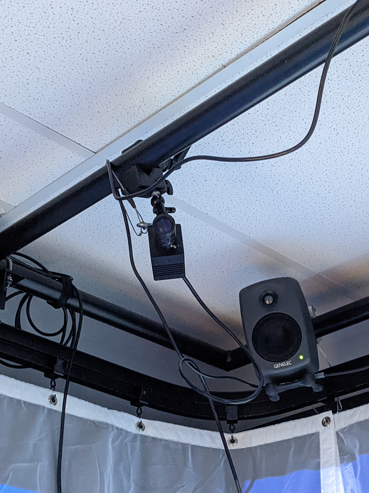

## Titre
L'horloge de l'apocalypse
## Les créateurs et créatrices
Maxime Sabourin

Louis-Philippe Gravel

Alexis Lacasse

Tristan Girard-Montpetit

Maxime De Falco

## La façon dont le thème du temps est exploité dans la création
Dans leur projet, le thème du temps sera exploité à l'aide d'une vidéo montrant l'évolution des époques qui sera projeté sur 3 murs.
## L'ambiance
L'ambiance du départ sera très calme et apaisant, mais plus le temps avancera sur l'horlorge, plus ça sera désagréable et dépressant.
## L'installation en cours dans les studios
 Source: *photo personnelle*
 [Source](https://tim-montmorency.com/2022/projets/L-horloge-de-l-apocalypse/docs/web/index.html)
 [Source](https://tim-montmorency.com/2022/projets/L-horloge-de-l-apocalypse/docs/web/index.html)
## Le schéma de l'installation prévue
 [Source](https://tim-montmorency.com/2022/projets/L-horloge-de-l-apocalypse/docs/web/index.html)
## Ce qui sera attendu de moi, en tant qu'interacteur, lorsque je ferai l'expérience de l'installation
Je serai invité à manipuler l’horloge grâce aux aiguilles et ainsi modifier la ligne du temps. Celle-ci changera la projection et l'audio.
## 3 cours du programme qui me semblent incontournables pour avoir les compétences pour créer ce projet
Conception sonore interactive

Montage vidéo

Traitement vidéo

##  Technique inconnue
Spatialisation des sons, consistent à créer l'illusion que des sons proviennent de diverses directions de l'espace et à organiser ainsi des scènes sonores en trois dimensions. Elles connaissent aujourd'hui un essor important. 
Source: [Pourlascience.fr](https://www.pourlascience.fr/sd/informatique/la-spatialisation-du-son-1755.php#:~:text=Les%20techniques%20de%20spatialisation%20du,aujourd'hui%20un%20essor%20important.)

## Composante inconnue

Arduino, il s'agit d'une plateforme de prototypage open-source qui permet aux utilisateurs de créer des objets électroniques interactifs à partir de cartes électroniques matériellement libres sur lesquelles se trouve un microcontrôleur. 
Source: [Wikipédia](https://fr.wikipedia.org/wiki/Arduino)
