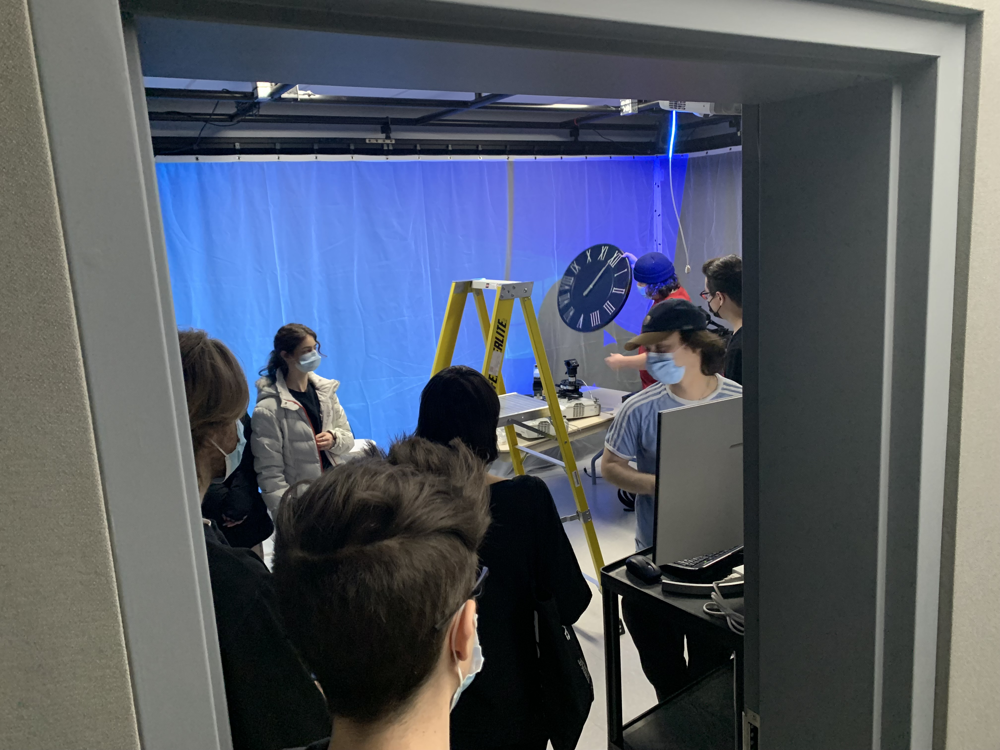
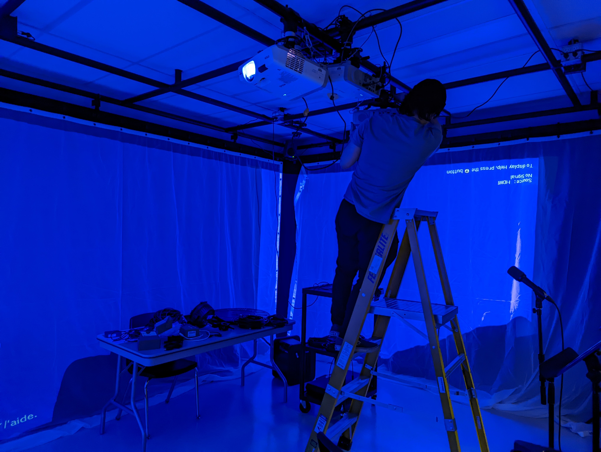

## Titre
L'horloge de l'apocalypse
## Les créateurs et créatrices
Maxime Sabourin

Louis-Philippe Gravel

Alexis Lacasse

Tristan Girard-Montpetit

Maxime De Falco

## La façon dont le thème du temps est exploité dans la création
Dans leur projet, le thème du temps sera exploité à l'aide d'une vidéo montrant l'évolution des époques qui sera projeté sur 3 murs.
## L'ambiance
L'ambiance du départ sera très calme et apaisant, mais plus le temps avancera sur l'horlorge, plus ça sera moins agréable et tranquille.
## L'installation en cours dans les studios
 source: photo personnelle
 source: GitHub des créateurs
 source: GitHub des créateurs
## Le schéma de l'installation prévue

## Ce qui sera attendu de vous, en tant qu'interacteur.trice, lorsque vous ferez l'expérience de l'installation

## 3 cours du programme qui vous semblent incontournables pour avoir les compétences pour créer ce projet (voir la grille de cours du programme)
