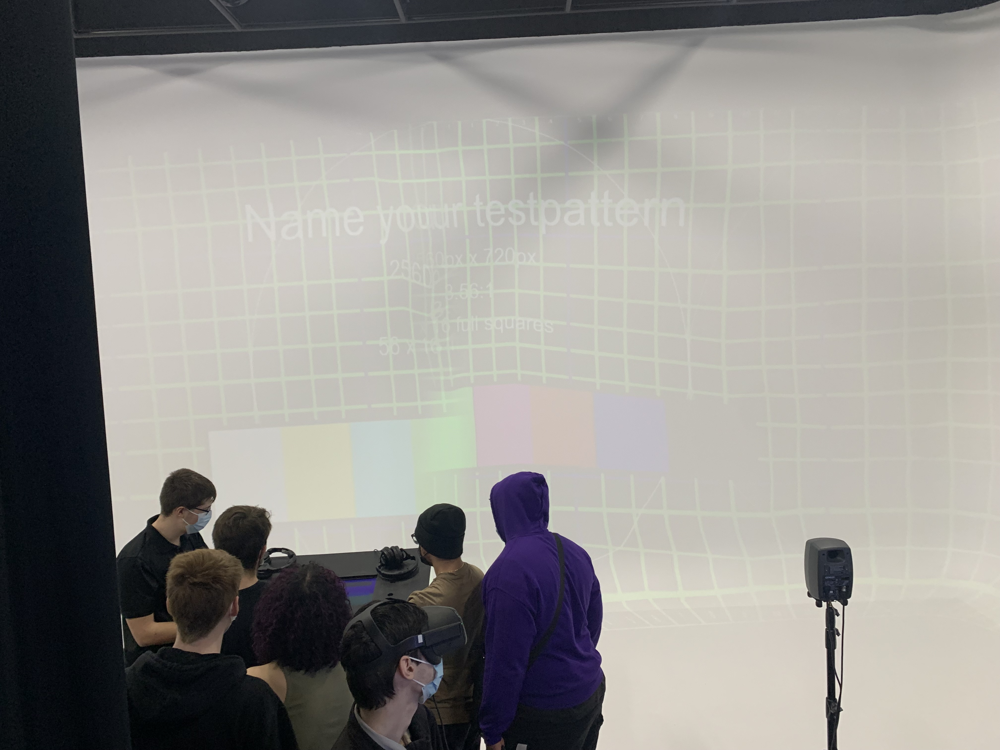

## Titre
Jeu Temporel
## Les créateurs et créatrices
Raphaël Fillion

Philippe Trudel

## La façon dont le thème du temps est exploité dans la création
Le thème du temps sera exploité en sensibilisiant nos actions sur notre futur envers l'environnement.
## L'ambiance
L'ambiance ressenti sera calme au commencement, mais au fur et à mesure des choix choisi par l'interacteur modifiera la fin du jeu. Cela pourrait savéré disatrueux donc triste ou une fin plutôt agréable et joyeux.
## L'installation en cours dans les studios
 Source: *photo personnelle*

 [Source](https://tim-montmorency.com/2022/projets/Jeu-Temporel/docs/web/preproduction.html)
 [Source](https://tim-montmorency.com/2022/projets/Jeu-Temporel/docs/web/preproduction.html)
## Le schéma de l'installation prévue
 [Source](https://tim-montmorency.com/2022/projets/Jeu-Temporel/docs/web/preproduction.html)
## Ce qui sera attendu de moi, en tant qu'interacteur, lorsque je ferai l'expérience de l'installation
Je serai invité à répondre à des questions au sujet de l'environnement ainsi que le changement climatique. Ces quesitons-ci s'afficherons sur l'écran inscusté dans le podium. Enfin, la fin de ce projet dépendera de mes décisions que j'aurais prise.
## 3 cours du programme qui me semblent incontournables pour avoir les compétences pour créer ce projet
Interactivité Web

Espace Intéractif

Introduction à la programation

##  Technique inconnue
Memoji, serais une application permettant de créer et de personnaliser des visages de style *emoji*. 

## Composante technologique inconnue

Arduino, il s'agit d'une plateforme de prototypage open-source qui permet aux utilisateurs de créer des objets électroniques interactifs à partir de cartes électroniques matériellement libres sur lesquelles se trouve un microcontrôleur. 
Source: [Wikipédia](https://fr.wikipedia.org/wiki/Arduino)
